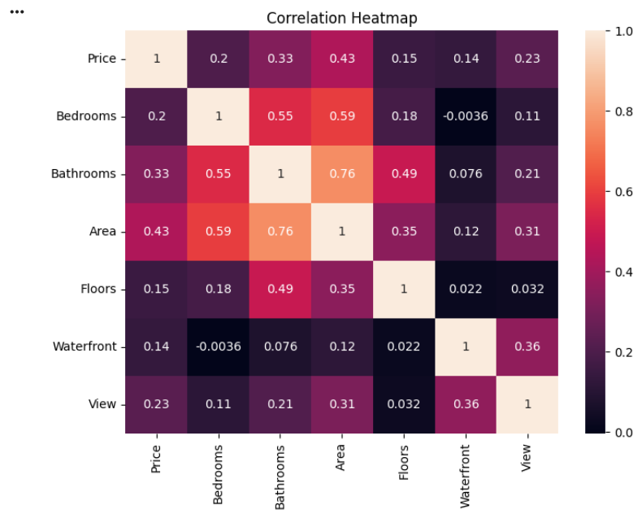
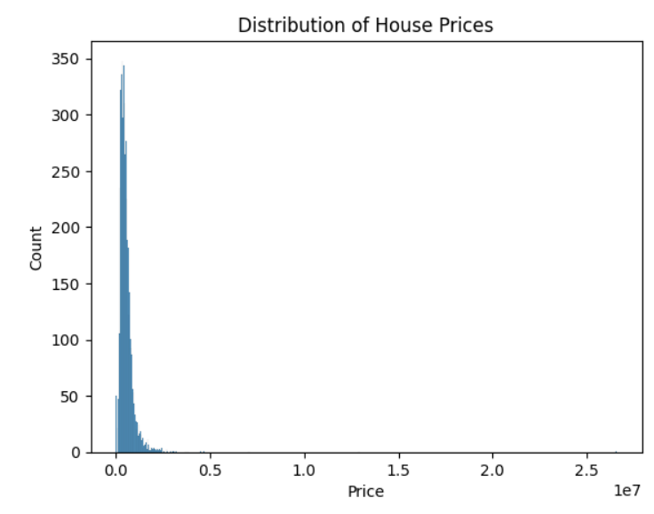
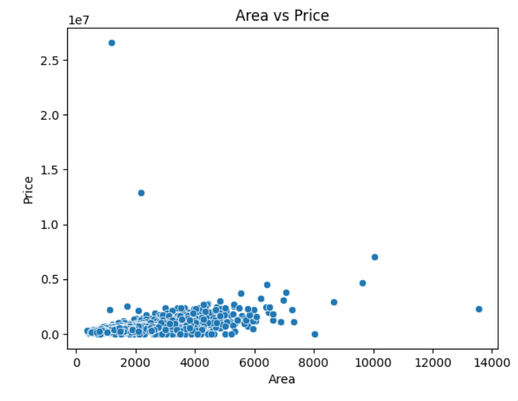
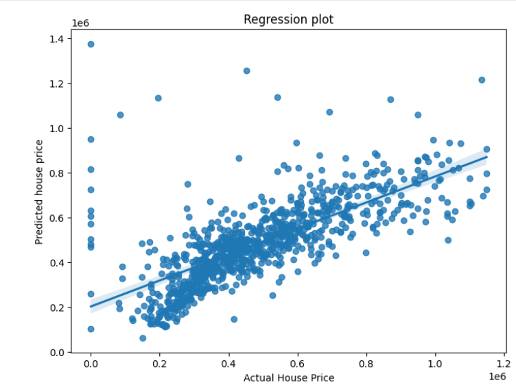
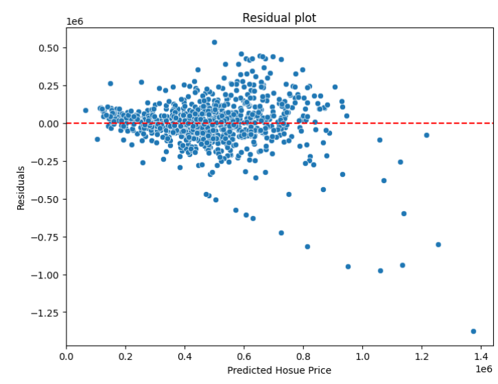
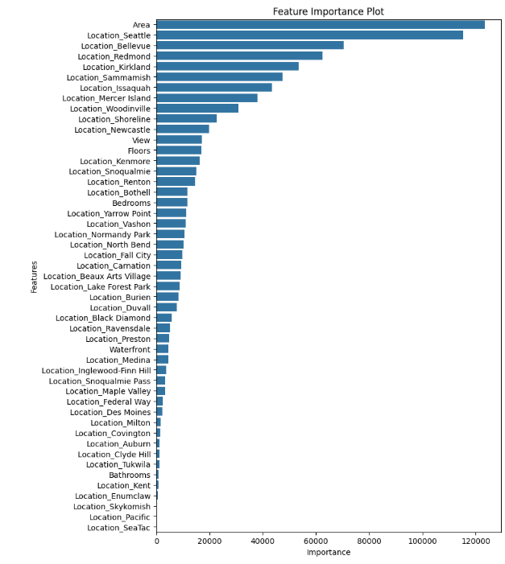

# 🏠 House Price Prediction using Machine Learning

A Machine Learning project that predicts house prices using various property features. This project demonstrates the complete machine learning workflow, including data preprocessing, exploratory data analysis (EDA), feature engineering, regression modeling, model evaluation, and interpretation of feature importance.

---

## 📌 Project Overview

Accurately predicting house prices is a common real-world regression problem. In this project, a house price prediction model was developed using the **House_data.csv** dataset. The project focuses on understanding the factors that influence house prices and building a predictive model capable of estimating property values based on multiple housing features.

---

## 🎯 Objectives

- Perform exploratory data analysis on housing data.
- Clean and preprocess the dataset.
- Handle categorical variables using encoding techniques.
- Detect and remove outliers.
- Train a regression model for house price prediction.
- Evaluate model performance using regression metrics.
- Identify the most influential features affecting house prices.

---

## 📂 Dataset

**Dataset:** `House_data.csv`

The dataset contains residential property information with the following features:

| Feature | Description |
|---------|-------------|
| Price | House price (Target Variable) |
| Area | Area of the house |
| Bedrooms | Number of bedrooms |
| Bathrooms | Number of bathrooms |
| Stories | Number of floors |
| Mainroad | Access to the main road |
| Guestroom | Availability of a guest room |
| Basement | Basement availability |
| Hotwaterheating | Hot water heating facility |
| Airconditioning | Air conditioning availability |
| Parking | Number of parking spaces |
| Prefarea | Preferred residential area |
| Furnishingstatus | Furnishing status |

---

## 🛠 Technologies Used

- Python
- Jupyter Notebook
- Pandas
- NumPy
- Matplotlib
- Seaborn
- Scikit-learn

---

## 📊 Exploratory Data Analysis (EDA)

The following analyses were performed:

- Dataset inspection
- Statistical summary
- Missing value analysis
- Correlation analysis
- Distribution analysis
- Outlier detection
- Scatter plots
- Regression analysis

---

## ⚙️ Data Preprocessing

The preprocessing pipeline includes:

- Handling missing values (if any)
- Encoding categorical variables
- Outlier detection and removal
- Feature selection
- Data splitting into training and testing sets

---

## 🤖 Machine Learning Model

The project uses **Ridge Regression** to predict house prices.

### Workflow

1. Import Libraries
2. Load Dataset
3. Data Cleaning
4. Exploratory Data Analysis
5. Feature Engineering
6. Train-Test Split
7. Model Training
8. Model Evaluation
9. Feature Importance Analysis

---

## 📈 Model Evaluation

The model performance is evaluated using:

- Mean Absolute Error (MAE)
- Mean Squared Error (MSE)
- Root Mean Squared Error (RMSE)
- R² Score

These metrics help evaluate the accuracy and reliability of the regression model.

---

## 📷 Project Visualizations

### Correlation Heatmap

Shows the relationship between numerical features.



---

### House Price Distribution

Illustrates the distribution of house prices in the dataset.



---

### Area vs Price

Shows the relationship between property area and selling price.



---

### Regression Results

Comparison between predicted and actual house prices.



---

### Residual Analysis

Visualizes prediction errors to assess model performance.



---

### Feature Importance

Highlights the features that contribute most to house price prediction.



---

## 📂 Project Structure

```
House-Price-Prediction/
│
├── House_Price_Prediction.ipynb
├── House_data.csv
├── README.md
├── requirements.txt
├── .gitignore
└── images/
    ├── correlation_heatmap.png
    ├── house_price_distribution.png
    ├── area_vs_price.png
    ├── regression_results.png
    ├── residual_plot.png
    └── feature_importance.png
```

---

## 🚀 Getting Started

### Clone the Repository

```bash
git clone https://github.com/Bhavyashree08S/House-Price-Prediction.git
```

### Navigate to the Project

```bash
cd House-Price-Prediction
```

### Install Required Libraries

```bash
pip install -r requirements.txt
```

### Run the Notebook

Open:

```
House_Price_Prediction.ipynb
```

using Jupyter Notebook or Google Colab.

---

## 💡 Future Improvements

- Hyperparameter tuning
- Cross-validation
- Model comparison with advanced regression algorithms
- Streamlit deployment
- Flask web application
- Real-time prediction interface

---

## 🧠 Skills Demonstrated

- Data Cleaning
- Data Preprocessing
- Exploratory Data Analysis (EDA)
- Data Visualization
- Feature Engineering
- Machine Learning
- Ridge Regression
- Model Evaluation
- Feature Importance Analysis
- Python Programming

---

## 📜 Conclusion

This project demonstrates an end-to-end machine learning workflow for predicting house prices using Ridge Regression. Through data preprocessing, exploratory data analysis, feature engineering, model training, and evaluation, the model provides meaningful insights into the factors influencing house prices. The project also highlights the importance of data visualization and feature importance analysis in building interpretable machine learning models.

---

## 👩‍💻 Author

**Bhavyashree**

MCA Graduate | Data Science & Analytics Enthusiast

- 💼 Open to Data Analyst, Data Science & Machine Learning opportunities
- 🔗 GitHub: https://github.com/Bhavyashree08S
- 🔗 LinkedIn: https://www.linkedin.com/in/bhavyashree-doomappa-jayasheela-a51755326/

---

⭐ **If you found this project helpful, consider giving it a Star!**
